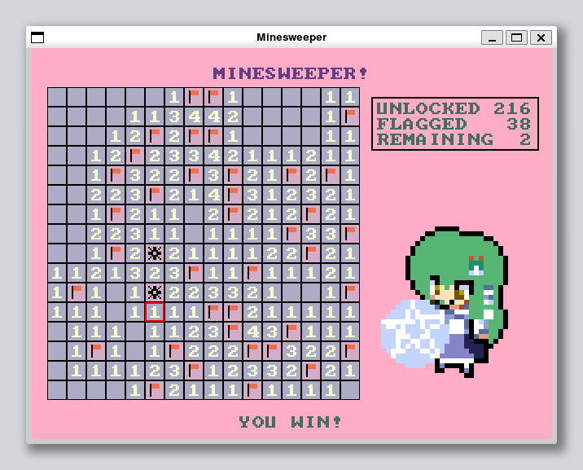
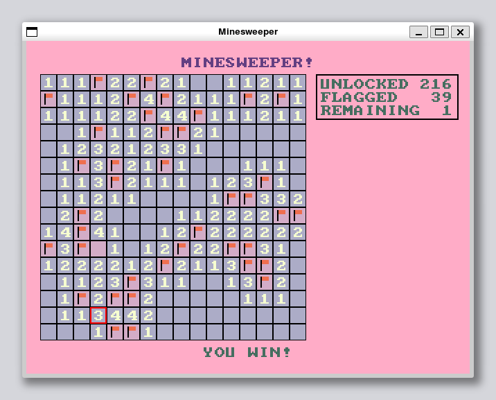
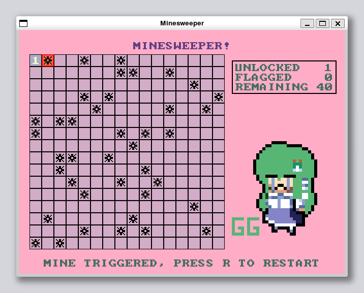

# MINESWEEPER!

<p align="center">
  
  
  
</p>

MINESWEEPER! is my project of hardware system at HUST, fall 2023. In this project, I developed a simplified minesweeper game, which supports:
- A 16x16 game board with 40 mines.
- Random generation of mine layouts.
- Ensuring that the first clicked cell will not be a mine.
- Marking flags on the cells freely.
- Running on a self-made RISC-V CPU.
- Running on x86 machines via SDL2.

## Requirements
```bash
paru -S clang lld cmake
```

## Build & Run
```bash
CC=clang LD=lld cmake -B build
cd build && make
./minesweeper
```

## TODO
- [x] Support receiving inputs from PS2 keyboard (on self-made RISC-V CPU).
- [x] Optimize the color scheme to make the UI more beautiful.
- [x] Support mouse for both x86 and self-made RISC-V machines.
- [x] Add a window containing some information about the game.
- [x] Add a message bar to guide players.
- [x] ~~Add a cheating button.~~